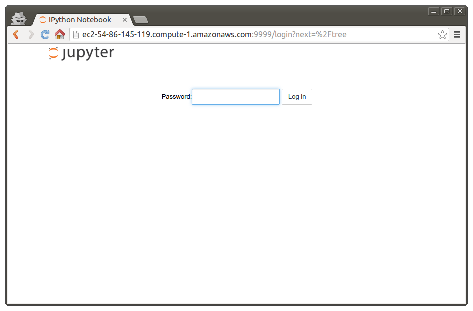

# **Jupiter Notebook** configuration [[back](index.md)]

(1) Create default jupiter config:
```sh
$ jupyter notebook --generate-config
```

(2) Generate password for jupiter notebook remote connect:
```sh
$ python -c "from notebook.auth import passwd ; print passwd()"
```
```
Enter password: 
Verify password: 
sha1:d789606b9c22:65fcab009f7253eb73e4b4e99996d8df614eae32
```

(3) Append password to jupiter config:
```sh
$ echo "
c.NotebookApp.password = u'sha1:d789606b9c22:65fcab009f7253eb73e4b4e99996d8df614eae32'
" >> ~/.jupyter/jupyter_notebook_config.py
```

(4) Append IP and PORT configuration:
```sh
echo "
c.NotebookApp.ip = '$(ifconfig eth0 | grep 'inet addr' | cut -d\: -f2 | cut -d\  -f1)'
c.NotebookApp.port = 9999
" >> ~/.jupyter/jupyter_notebook_config.py
```

(5) Check jupiter installation

(5.1) go to work directory and run jupiter notebook:
```sh
$ cd ~/deep-learning
$ jupyter notebook
```

(5.2) open url in browser [http://ec2-54-86-145-119.compute-1.amazonaws.com:9999]
create simple notebook and run code.
See screenshoots


and


