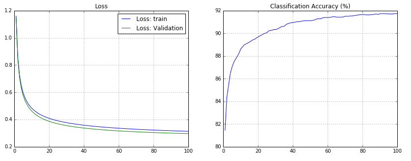

Logistic Regression with Theano [[back](index.md)]
==========================

At this point Theano is already installed in the system.

To work with the MNIST dataset we will use a helper method from Tensorflow package:


```python
from tensorflow.examples.tutorials.mnist import input_data
mnist = input_data.read_data_sets("MNIST_data/", one_hot=False)
```

Model Parameters:
 - Number of epochs: 100
 - Batch size: 256
 - Learning rate: 0.01
 - Train samples: 55000
 - Validation samples: 5000
 - Test samples: 10000

--------
To run code:

```
$ cd ~/gitlab.altoros/776_DL_Libs_Benchmark.git/
$ git pull
$ cd src/Step02/SubStep-01-Theano/
$ python Theano_LogisticRegression.py
```

or
```
$ cd ~/gitlab.altoros/776_DL_Libs_Benchmark.git/
$ cd src/Step02/SubStep-01-Theano/
$ jupyter notebook Theano_LogisticRegression_Notebook.ipynb
```
and go to the URL  [http://ec2-54-86-145-119.compute-1.amazonaws.com:9999](http://ec2-54-86-145-119.compute-1.amazonaws.com:9999): 


Quick results:
```
...
-------------
Optimization complete with best validation score of inf %, with test performance 8.253205 %
The code run for 100 epochs, with 3.045976 epochs/sec
The code for file [Theano_LogisticRegression.py]  ran for 32.8s
```


--------
Traing process:



--------
Weights visualisation:


