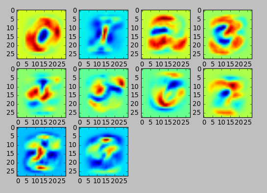

Logistic Regression with Theano and Blocks Framework [[back](index.md)]
==========================

At this point Theano is already installed in the system.

# Installation Blocks:

1. Install Fuel package, latest version (Blocks interface for popular datasets)
```
$ sudo pip install git+https://github.com/mila-udem/fuel#egg=fuel
```

2. Install Blocks package, latest version:
```
$ sudo pip install git+git://github.com/mila-udem/blocks.git
```

3. Update Theano package to latest version:
```
$ sudo pip install git+https://github.com/Theano/Theano.git#egg=theano -U
```

4. Create fuel config file (~/.fuelrc) with default path to dataset:
```
$ mkdir ~/deep-learning/data-fuel
$ echo 'data_path: "/home/ubuntu/deep-learning/data-fuel"' > ~/.fuelrc
```

5. Doenload MNIST dataset with Fuel utility:
```
$ cd ~/deep-learning/data-fuel
$ fuel-download mnist
$ fuel-convert mnist
```

-----
# Run prepared example:
In command line:
```
$ cd ~/gitlab.altoros/776_DL_Libs_Benchmark.git/src/Step02/SubStep-01.01-Theano-Blocks/
$ python Theano_Blocks_LogisticRegression.py
```

--------
Weights visualisation:




--------

```
...
-------------------------------------------------------------------------------
TRAINING HAS BEEN FINISHED:
-------------------------------------------------------------------------------
Training status:
	 batch_interrupt_received: False
	 epoch_interrupt_received: False
	 epoch_started: False
	 epochs_done: 30
	 iterations_done: 7050
	 received_first_batch: True
	 resumed_from: None
	 training_started: True
Log records from the iteration 7050:
	 test_cost_with_regularization: 0.533775537828
	 test_misclassificationrate_apply_error_rate: 0.0949856505102
	 training_finish_requested: True
	 training_finished: True
```
