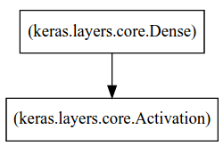
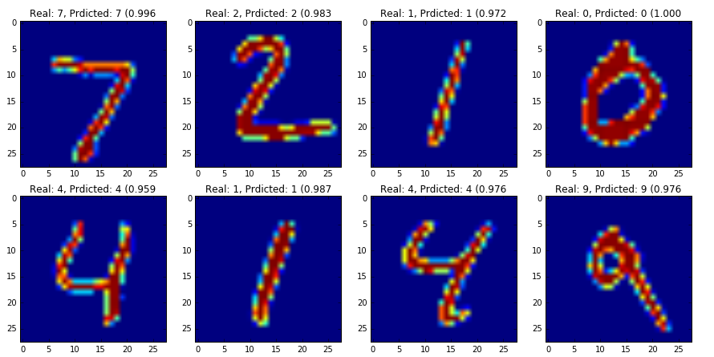

Logistic Regression with Theano and Keras Framework [[back](index.md)]
==========================

At this point Theano is already installed in the system.

1. Install Keras:
```
$ sudo pip install keras
```

2. Install addition Python-SVG modules:
```
$ sudo apt-get install python-pydot
$ sudo pip install pydot -U
```

3. To run example code:
```
$ cd ~/gitlab.altoros/776_DL_Libs_Benchmark.git/src/Step02/SubStep-01.03-Theano-Keras
$ jupyter notebook Theano_Keras_LogisticRegression_Notebook.ipynb
```

and go to the URL: [http://ec2-54-172-161-206.compute-1.amazonaws.com:9999/](http://ec2-54-172-161-206.compute-1.amazonaws.com:9999/tree)


3. To work with the MNIST dataset we will use a helper method from Tensorflow package:

```python
from tensorflow.examples.tutorials.mnist import input_data
mnist = input_data.read_data_sets("MNIST_data/", one_hot=False)
```

--------
Network visualisation:



--------
Classification visualisation:



--------
Weights visualisation:


