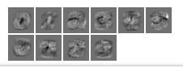

Logistic Regression with Torch [[back](index.md)]
==========================

At this point Torch is already installed in the system.

1. Download and unpack MNIST dataset in Torch internal format:
```
$ cd ~/gitlab.altoros/776_DL_Libs_Benchmark.git/src/Step02/SubStep-02-Torch
$ wget http://torch7.s3-website-us-east-1.amazonaws.com/data/mnist.t7.tgz
$ tar xzf mnist.t7.tgz
```

2. Run code:
```
$ cd ~/gitlab.altoros/776_DL_Libs_Benchmark.git/src/Step02/SubStep-02-Torch
$ jupyter notebook Torch_LogisticRegression.ipynb
```

and open URL: [http://ec2-54-172-161-206.compute-1.amazonaws.com:9999/](http://ec2-54-172-161-206.compute-1.amazonaws.com:9999/)

-------
Weights matrix initialization:


-------
Weights matrix after training:


