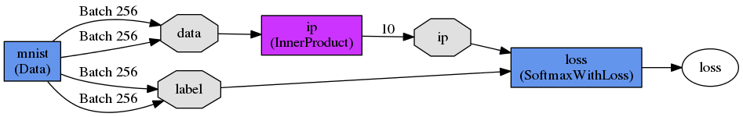
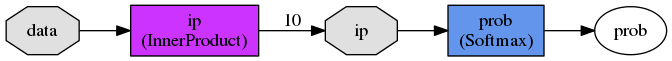
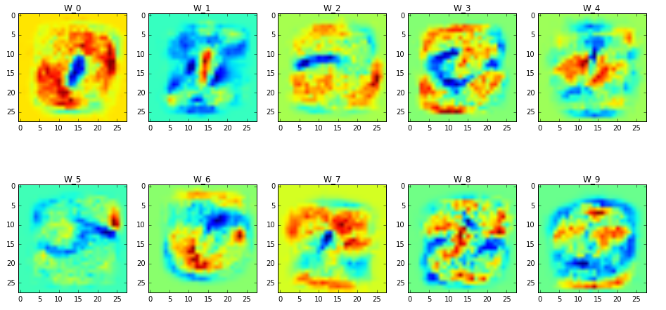
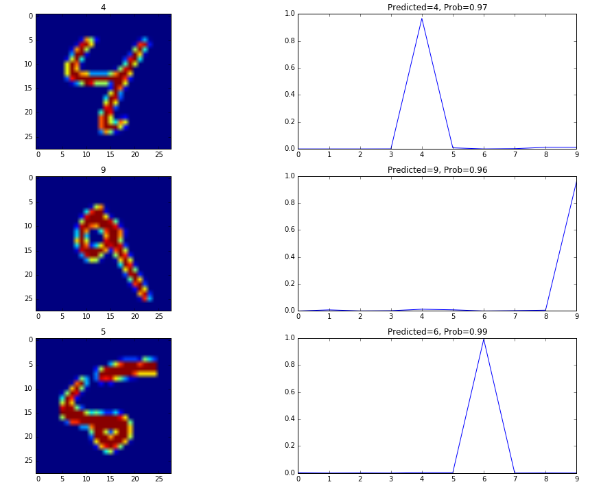

Logistic Regression with Caffe [[back](index.md)]
==========================

1. Download MNIST Dataset:
```
$ cd ~/gitlab.altoros.com/776_DL_Libs_Benchmark.git/src/Step02/SubStep-03-Caffe
$ cd ./mnist-raw
$ bash get_mnist.sh
```

2. Prepare LMDB Database with MNIST data:
```
$ cd ~/gitlab.altoros.com/776_DL_Libs_Benchmark.git/src/Step02/SubStep-03-Caffe
$ ./run01_create_mnist.sh
```

3. Create NeuralNetwork (Logistic Regression) Graph image:
```
$ cd ~/gitlab.altoros.com/776_DL_Libs_Benchmark.git/src/Step02/SubStep-03-Caffe
$ ./run02_gen_netgraph_image.sh
```

-----
And visualize pretty image:



-----
Next step: you can Train LogisticRegression Classifier


1. Prepare Train-Protobuf file [mnist_logreg_train.prototxt](src/Step02/SubStep-03-Caffe/mnist_logreg_train.prototxt):
```json
name: "LogReg"
layer {
    name: "mnist"
    type: "Data"
    top: "data"
    top: "label"
    include {
        phase: TRAIN
    }
    data_param {
        source: "mnist_train_lmdb"
        batch_size: 256
        backend: LMDB
    }
    transform_param {
        scale: 0.00390625
    }
}
layer {
    name: "mnist"
    type: "Data"
    top: "data"
    top: "label"
    include {
        phase: TEST
    }
    data_param {
        source: "mnist_test_lmdb"
        batch_size: 256
        backend: LMDB
    }
    transform_param {
        scale: 0.00390625
    }
}
layer {
    name: "ip"
    type: "InnerProduct"
    bottom: "data"
    top: "ip"
    inner_product_param {
    num_output: 10
    }
}
layer {
    name: "loss"
    type: "SoftmaxWithLoss"
    bottom: "ip"
    bottom: "label"
    top: "loss"
}
```

2. and Solver Config [mnist_logreg_solver.prototxt](src/Step02/SubStep-03-Caffe/mnist_logreg_solver.prototxt):
```json
    net: "mnist_logreg_train.prototxt"
    test_iter: 5000
    test_interval: 50000
    base_lr: 0.01
    momentum: 0.9
    weight_decay: 0.0005
    lr_policy: "inv"
    gamma: 0.0001
    power: 0.75
    display: 5000
    max_iter: 100000
    snapshot: 25000
    snapshot_prefix: "mnist_logreg"
    # solver mode: CPU or GPU
    solver_mode: GPU
```

3. and Run It!:
```
$ cd ~/gitlab.altoros/776_DL_Libs_Benchmark.git/src/Step02/SubStep-03-Caffe
$ ./run03_train_mnist_logreg.sh
```

4. at the end you can see some trained models (for specific train-iteration):
```
$ ls -1 mnist_logreg_iter_*
    mnist_logreg_iter_100000.caffemodel
    mnist_logreg_iter_100000.solverstate
    mnist_logreg_iter_20736.caffemodel
    mnist_logreg_iter_20736.solverstate
    mnist_logreg_iter_25000.caffemodel
    mnist_logreg_iter_25000.solverstate
    mnist_logreg_iter_50000.caffemodel
    mnist_logreg_iter_50000.solverstate
    mnist_logreg_iter_75000.caffemodel
    mnist_logreg_iter_75000.solverstate
```

5. Next you can generate Network Grapch image for Inference model:
```
$ cd ~/gitlab.altoros.com/776_DL_Libs_Benchmark.git/src/Step02/SubStep-03-Caffe
$ ./run04_gen_netgraph_image_inference.sh
```

6. and visualize it:



-----------
7. Next You can run jupyter notebook code to visualize Network weights and try 

to predict on test data:

```
$ cd ~/gitlab.altoros/776_DL_Libs_Benchmark.git/src/Step02/SubStep-03-Caffe
$ jupyter notebook Caffe_LogisticRegression_Notebook.ipynb
```

-----------

Weights visualization:




Prediction on test-data:




