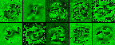
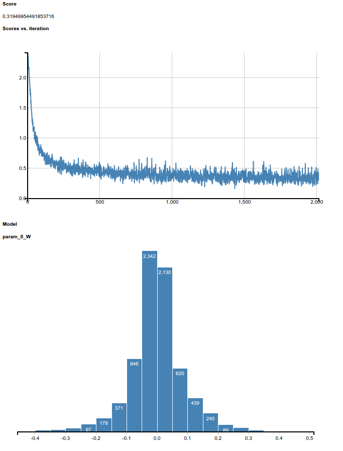
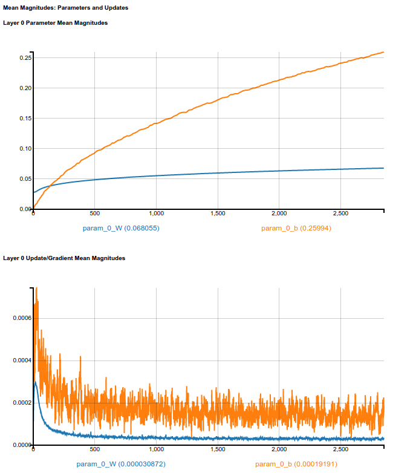

Logistic Regression with DeepLearning4J [[back](index.md)]
==========================

1. To build Java project with DeepLEarning4J we use maven. Prepare pom-file:

```xml
<project xmlns:xsi="http://www.w3.org/2001/XMLSchema-instance" xmlns="http://maven.apache.org/POM/4.0.0"
         xsi:schemaLocation="http://maven.apache.org/POM/4.0.0 http://maven.apache.org/xsd/maven-4.0.0.xsd">
    <modelVersion>4.0.0</modelVersion>

    <groupId>by.grid.imlab</groupId>
    <artifactId>DeepAltorosD4J</artifactId>
    <version>1.0-SNAPSHOT</version>
    <packaging>jar</packaging>

    <name>DeepAltorosD4J</name>
    <url>http://maven.apache.org</url>
    <repositories>
        <repository>
            <id>central</id>
            <url>https://repo1.maven.org/maven2</url>
            <releases>
                <enabled>true</enabled>
            </releases>
        </repository>
    </repositories>

    <properties>
        <project.build.sourceEncoding>UTF-8</project.build.sourceEncoding>
        <nd4j.version>0.4-rc3.8</nd4j.version>
        <dl4j.version>0.4-rc3.8</dl4j.version>
        <canova.version>0.0.0.14</canova.version>
    </properties>

    <dependencies>
        <dependency>
            <groupId>junit</groupId>
            <artifactId>junit</artifactId>
            <version>3.8.1</version>
            <scope>test</scope>
        </dependency>
        <dependency>
            <groupId>org.deeplearning4j</groupId>
            <artifactId>deeplearning4j-core</artifactId>
            <version>${dl4j.version}</version>
        </dependency>
        <dependency>
            <groupId>org.deeplearning4j</groupId>
            <artifactId>deeplearning4j-ui</artifactId>
            <version>${dl4j.version}</version>
        </dependency>
        <dependency>
            <groupId>com.google.guava</groupId>
            <artifactId>guava</artifactId>
            <version>19.0</version>
        </dependency>
        <dependency>
            <groupId>org.nd4j</groupId>
            <artifactId>nd4j-x86</artifactId>
            <version>${nd4j.version}</version>
        </dependency>
        <dependency>
            <artifactId>canova-api</artifactId>
            <groupId>org.nd4j</groupId>
            <version>${canova.version}</version>
        </dependency>
    </dependencies>
    
    <build>
        ...
    </build>
</project>
```

1. Build DeepLearning4J LogisticRegression project:

```
$ cd ~/gitlab.altoros/776_DL_Libs_Benchmark.git/src/Step02/SubStep-05-DeepLearning4J
$ mvn clean
$ mvn package
```

2. and run LogisticRegression example:
```
$ cd ~/gitlab.altoros/776_DL_Libs_Benchmark.git/src/Step02/SubStep-05-DeepLearning4J
$ java -cp target/DeepAltorosD4J-1.0-SNAPSHOT.jar by.grid.imlab.LogisticRegressionMNIST
```

3. results:
```
==========================Scores========================================
 Accuracy:  0.9177
 Precision: 0.9168
 Recall:    0.9167
 F1 Score:  0.9167
========================================================================
```

--------
Weight visualization:





--------
4. You can visualize network training process in browser, just add one line code:
```Java
    ...
    model.init();
    model.setListeners(new HistogramIterationListener(1));
    ...
```

5. and after rerun application (see step 2.) open URL
[ec2-52-91-93-153.compute-1.amazonaws.com:60105/weights](http://ec2-52-91-93-153.compute-1.amazonaws.com:60105/weights):







